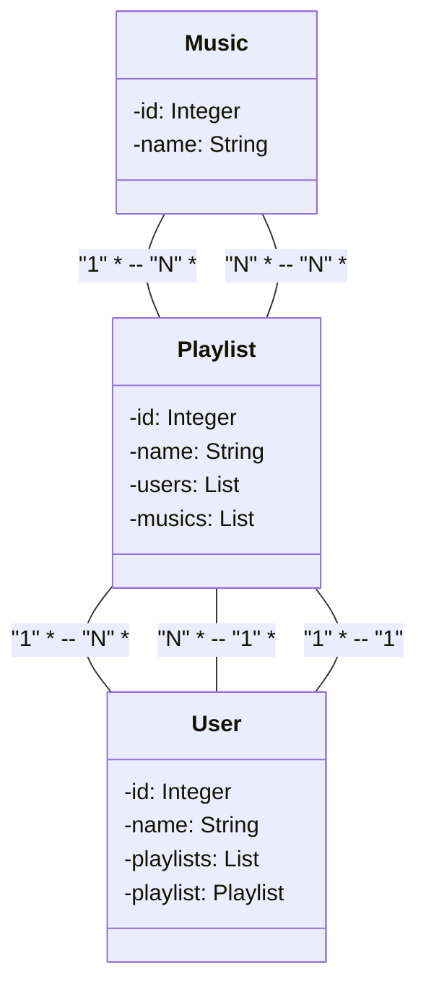

 # Publicando Api Rest SpringBoot 3 +  Java + Gradle na Nuvem
 
 - Tem como o objetivo a criação da uma api para organizar música em playlist

## Tecnologias utilizadas

 
  
  &nbsp;&nbsp;&nbsp;
  &nbsp;&nbsp;&nbsp;
   &nbsp;&nbsp;&nbsp;
  &nbsp;&nbsp;&nbsp;
   
  &nbsp;&nbsp;&nbsp;
  &nbsp;&nbsp;&nbsp;
   
  &nbsp;&nbsp;&nbsp;
  
              

 

- Java Jdk&nbsp; 17
- Swagger &nbsp;&nbsp;OpenApi &nbsp; 2.2.0
- Spring &nbsp;  3.1.3
- Gradle &nbsp;  7.6.1 
- PostgreSQL - Versão via Gradle (runtimeOnly 'org.postgresql:postgresql')
- RailAway - Plataforma Hospedeira de Soluções
- Git - Sistema de controle de versões
- GitHub - Plataforma de hospedagem de código
- UML - Linguagem padrão para a elaboração da estrutura de projeto

## O Código

- O Back-End tem os métodos do CRUD para cada entidade  
Nos métodos "adicionarPlaylist" e "adicionarMusica", tem como requisito o "id" dos itens que deseja associar 
- No tratamento de exceções, foi aplicado o padrão RFC 7807 - Problem Details for HTTP APIs, que detalha com mais precisão uma possível "exceção"

## A UML

